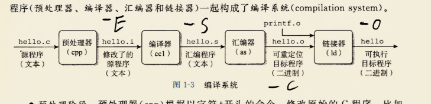
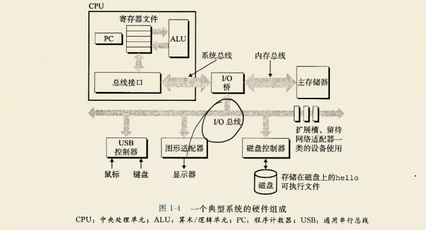
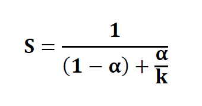

## 翻译成其它格式

* -E：仅执行编译预处理；
* -c：仅执行编译操作，不进行连接操作；
* -S：将C代码转换为汇编代码；
* -o：指定生成的输出文件。

## 运行流程

键盘输入./hello-->寄存器-->内存

按下回车后:从磁盘读取文件-->io桥-->内存(利用了**直接储存器存取(DMA)技术**,不通过处理器直接到内存)

开始执行:代码从内存-->寄存器文件-->显示器

## Amdahl 阿姆达尔定律
当我们对系统的某个部分加速时,其对系统整体性能的影响取决于改部分的重要性和加速程度.

加速比:S

提升/原速率:k

提升部分时间/总时间:α
